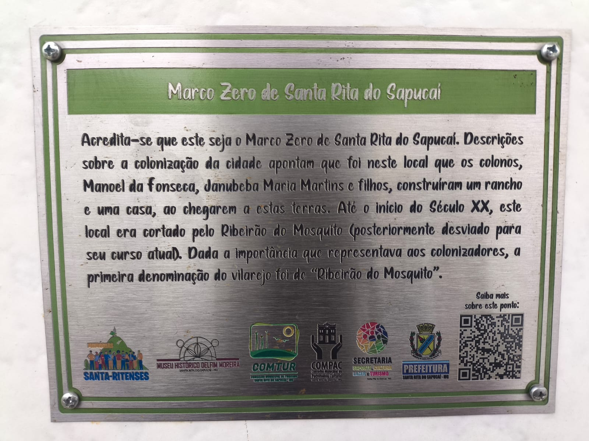
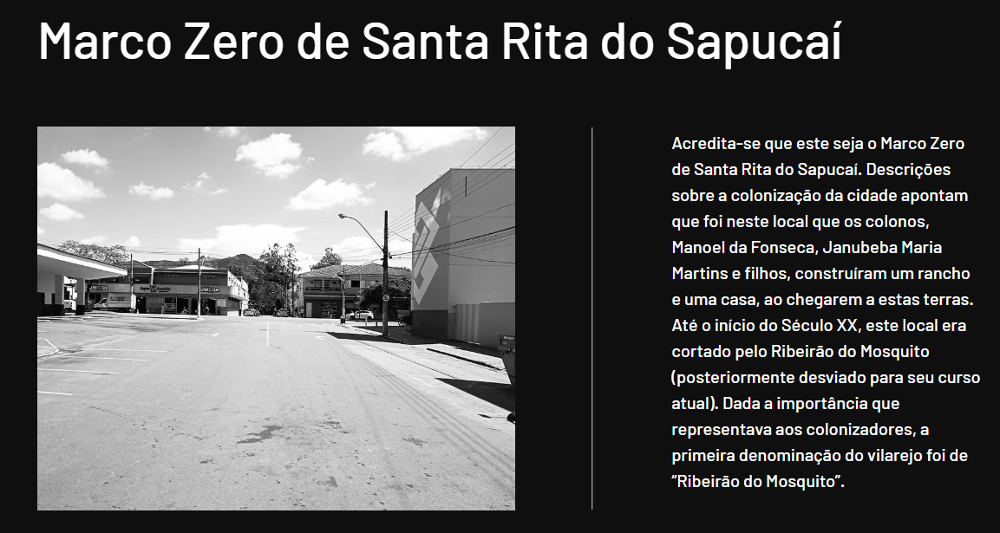

## Análise da placa

**Nome:** João Lucas Marques de Lima

# 404: Origem Perdida

---

## 📜 Descrição do Desafio

> *"O ponto zero de uma cidade sem memórias, apenas uma pequena placa de metal antigo marca o local. Acredita-se que naquela alameda foi onde começou o vilarejo de Ribeirão do mosquito que depois cresceu para se tornar um dos maiores polos eletrônicos do país.*  
> *Porém, nada escapa do tempo irrefreável, nem mesmo o começo pode escapar do esquecimento. Cabe a você descobrir, onde está a origem?"*

---

## 🔍 Análise e Resolução

### 1. Leitura e Análise da Imagem Base
A imagem fornecida exibe uma placa de metal referente ao **Marco Zero de Santa Rita do Sapucaí - MG**, contendo o histórico do antigo vilarejo *Ribeirão do Mosquito*. No canto inferior direito da placa, há um **QR Code** para mais informações sobre o local.



---

### 2. Análise do QR Code
Ao escanear o QR Code gravado na placa, a URL apontava para um domínio que se encontrava inativo (página de venda de domínio).

---

### 3. Recuperação de Dados com Wayback Machine
Como o link original estava quebrado, a URL foi consultada no **Wayback Machine (Archive.org)** para obter versões arquivadas da página. Através de uma captura antiga, foi possível recuperar dados e imagens históricas do local que não estavam mais visíveis publicamente.



---

### 4. Localizaçao
Com a imagem de referência obtida no arquivo da página, foi realizado um levantamento visual no **Google Maps / Street View** na região central de Santa Rita do Sapucaí. O cruzamento das características arquitetônicas confirmou o local exato da placa: a **Casa Miranda**.

---

## 🚩 Flag

```text
FLAG{CASA_MIRANDA}